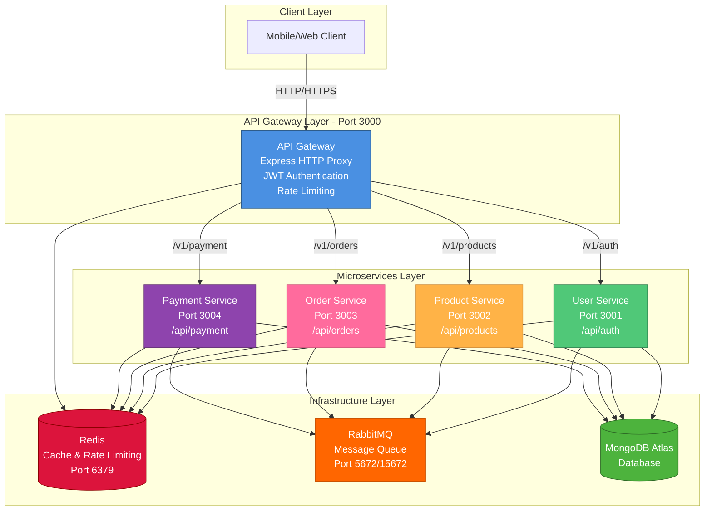
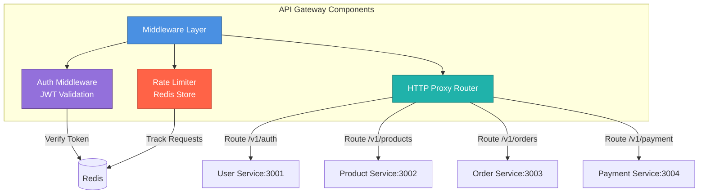
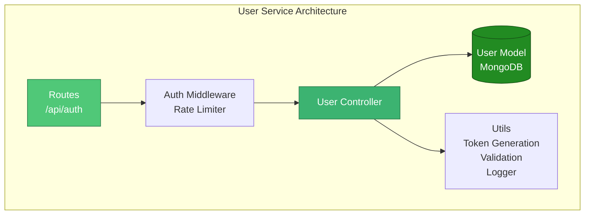
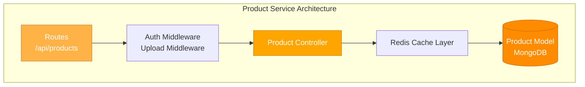
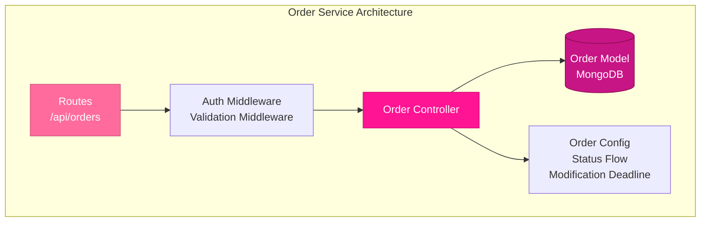
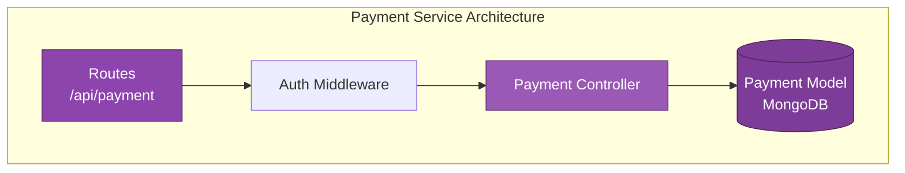
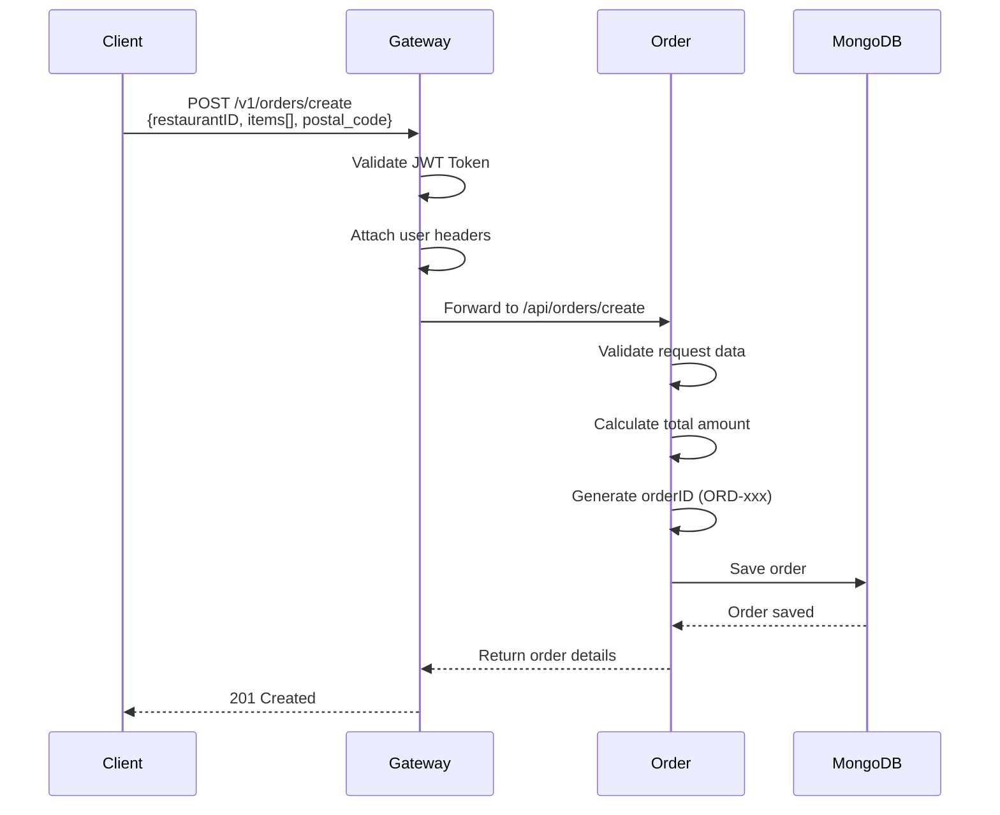
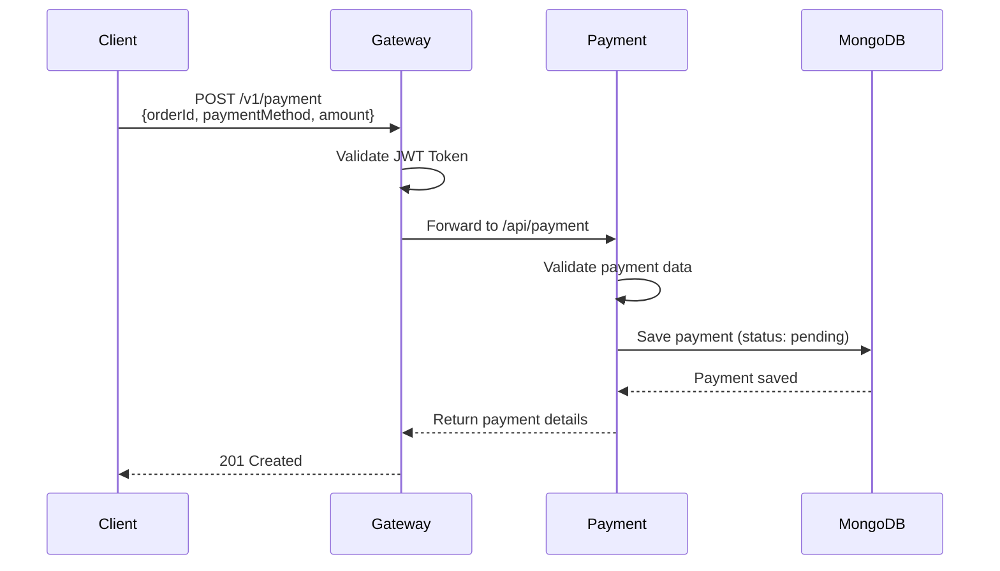

# Food Delivery Platform - Component Diagram

## System Architecture Overview

---

## Detailed Service Architecture

### 1. API Gateway (Port 3000)

**Responsibilities:**
- Route requests to appropriate microservices
- JWT token validation and user authentication
- Rate limiting (100 requests per 15 minutes)
- Attach user context headers (x-user-id, x-user-role)
- Centralized error handling and logging

**Technologies:**
- Express.js
- express-http-proxy
- Redis for rate limiting
- Winston for logging
- Helmet for security

---

### 2. User Service (Port 3001)

**Endpoints:**
- `POST /api/auth/register` - User registration
- `POST /api/auth/login` - User login
- `GET /api/auth/profile` - Get user profile
- `PUT /api/auth/profile` - Update profile

**Features:**
- User authentication (register/login)
- JWT token generation
- Password hashing with bcrypt
- Role-based access (user, restaurant, delivery)
- Redis caching
- Rate limiting on sensitive endpoints

**Database Schema:**
- User: userId, email, password, role, profile info

---

### 3. Product Service (Port 3002)

**Endpoints:**
- `GET /api/products` - Get all products
- `GET /api/products/:id` - Get product by ID
- `GET /api/products/restaurant/:restaurantId` - Get products by restaurant
- `GET /api/products/category/:categoryName` - Get products by category
- `POST /api/products` - Create product (admin/restaurant)
- `PUT /api/products/:id` - Update product
- `DELETE /api/products/:id` - Delete product
- `POST /api/products/upload` - Upload product image

**Features:**
- Product catalog management
- Category filtering
- Restaurant-based product queries
- Image upload support
- Redis caching for fast retrieval
- RabbitMQ integration

**Database Schema:**
- Product: productId, name, price, description, category, restaurantId, image

---

### 4. Order Service (Port 3003)

**Endpoints:**
- `POST /api/orders/create` - Create new order
- `GET /api/orders/user` - Get user's orders
- `GET /api/orders/:id` - Get order by ID
- `GET /api/orders/restaurant/:restaurantId` - Get restaurant orders
- `GET /api/orders/postal-code/:postalCode` - Get orders by postal code (delivery)
- `PUT /api/orders/:id/status` - Update order status
- `PUT /api/orders/:id` - Modify pending order
- `PUT /api/orders/:id/update` - Update order (restaurant/delivery)

**Features:**
- Order creation with item details and pricing
- Order status workflow management
- Pending order modification (time-limited)
- Restaurant order management
- Delivery assignment by postal code
- Role-based status transitions
- No external service dependencies (self-contained)

**Order Status Flow:**
- User: Pending → Cancelled
- Restaurant: Pending → Confirmed → Preparing → Ready
- Delivery: Ready → Out for Delivery → Delivered

**Database Schema:**
- Order: orderID, userID, restaurantID, items[], totalAmount, status, postal_code, paymentStatus, modification_deadline

---

### 5. Payment Service (Port 3004)

**Endpoints:**
- `POST /api/payment` - Create payment
- `GET /api/payment/:orderId` - Get payment by order ID

**Features:**
- Payment record creation
- Payment method tracking
- Payment status management
- Transaction ID support
- Order-based payment queries

**Payment Methods:**
- Credit/Debit Card
- Cash/COD
- E-Wallets (Momo, ZaloPay, VNPay)
- Bank Transfer

**Payment Status:**
- pending (default)
- completed
- failed

**Database Schema:**
- Payment: orderId, paymentMethod, amount, status, transactionId

---

## Data Flow Diagrams

### Order Creation Flow

### Payment Creation Flow

---

## Infrastructure Components

### Redis

**Purpose:**
- Rate limiting storage
- Session caching
- API response caching

**Port:** 6379

**Used By:** All services + API Gateway

---

### RabbitMQ

**Purpose:**
- Asynchronous message queue
- Event-driven communication
- Service decoupling

**Ports:** 
- 5672 (AMQP)
- 15672 (Management UI)

**Used By:** All microservices

---

### MongoDB Atlas

**Purpose:**
- Primary data storage
- Document-based NoSQL database

**Collections:**
- users
- products
- orders
- payments

**Used By:** All microservices (shared database)

---

## Key Architectural Decisions

### ✅ Strengths

1. **API Gateway Pattern**: Centralized entry point with authentication and rate limiting
2. **Independent Services**: Each microservice is self-contained with its own logic
3. **Shared Infrastructure**: Redis and RabbitMQ for caching and messaging
4. **Role-Based Access**: User, restaurant, and delivery roles with proper authorization
5. **Custom ID Format**: Order service uses custom IDs (ORD-xxx) for better readability

### ⚠️ Considerations

1. **Shared Database**: All services use the same MongoDB instance (not truly independent databases)
2. **No Service Discovery**: Services have hardcoded URLs
3. **Synchronous Communication**: No async event-driven architecture between services
4. **No Circuit Breaker**: No fault tolerance mechanism for service failures

---

## Technology Stack Summary

| Component | Technologies |
|-----------|-------------|
| **Runtime** | Node.js, Express.js |
| **Database** | MongoDB Atlas |
| **Cache** | Redis |
| **Message Queue** | RabbitMQ |
| **Authentication** | JWT |
| **Logging** | Winston |
| **Security** | Helmet, CORS |
| **Validation** | express-validator |
| **Containerization** | Docker, Docker Compose |

---

## Port Mapping

| Service | Internal Port | External Port |
|---------|---------------|---------------|
| API Gateway | 3000 | 3000 |
| User Service | 3001 | - |
| Product Service | 3002 | - |
| Order Service | 3003 | - |
| Payment Service | 3004 | - |
| Redis | 6379 | 6379 |
| RabbitMQ | 5672, 15672 | 5672, 15672 |
